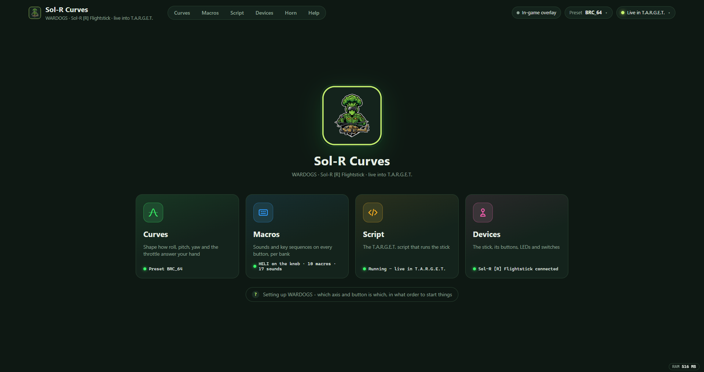
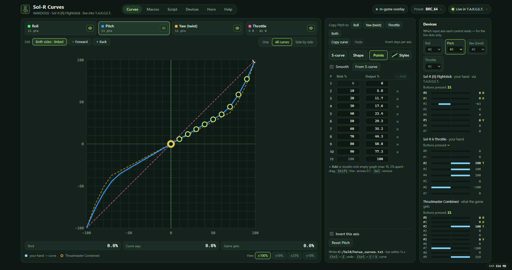
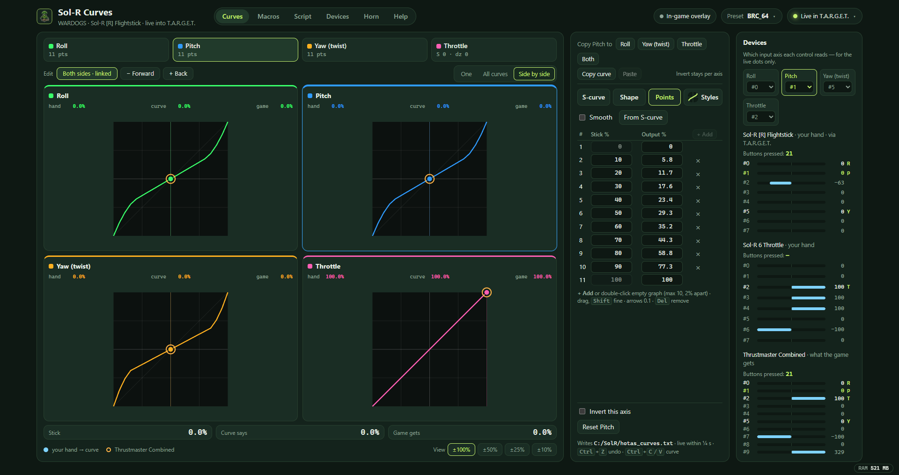
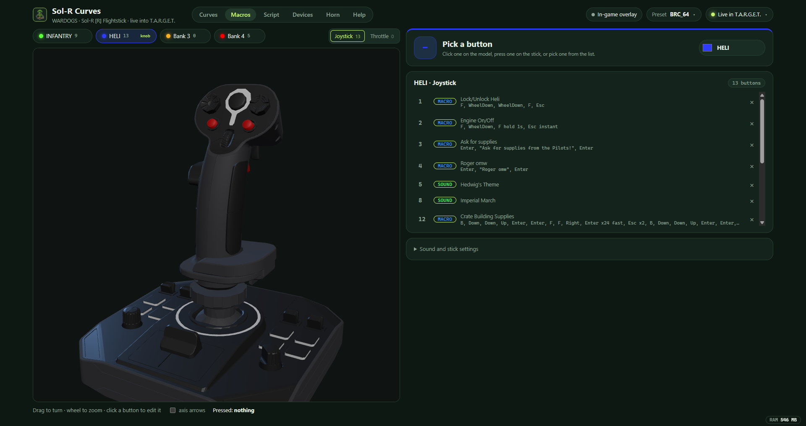
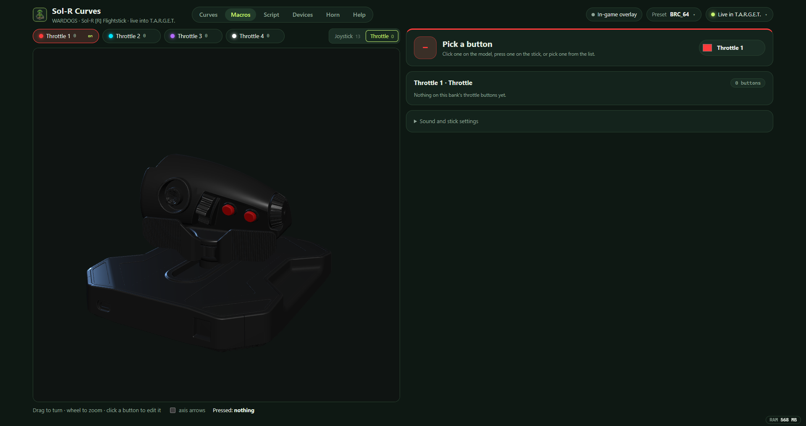
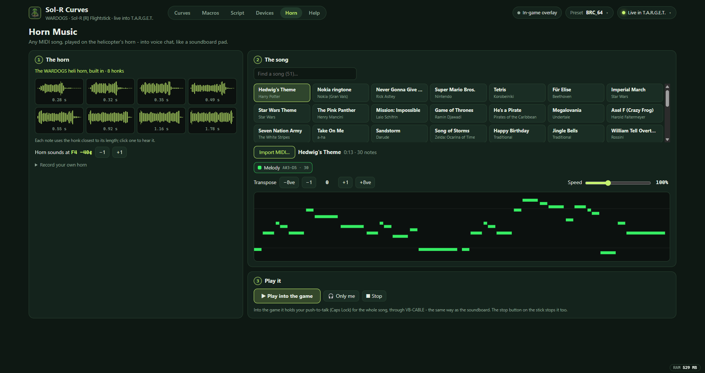
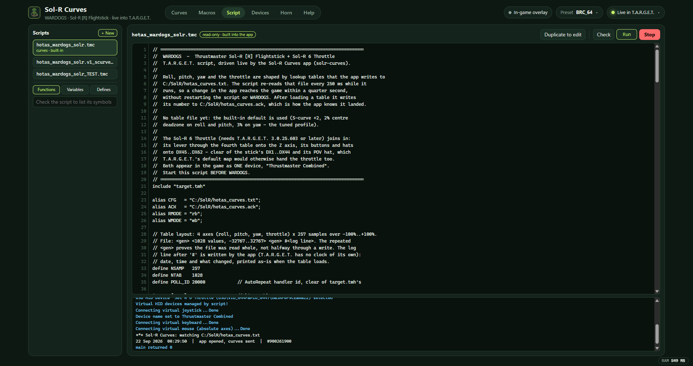
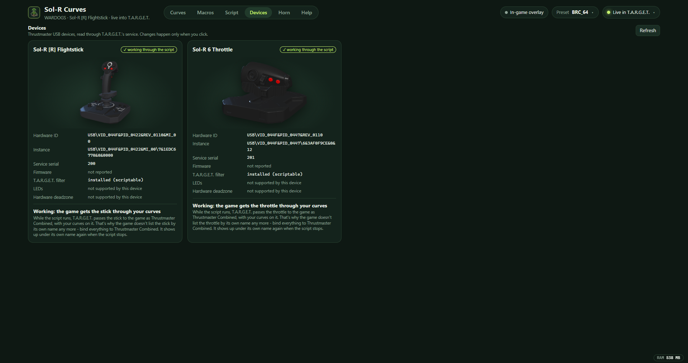
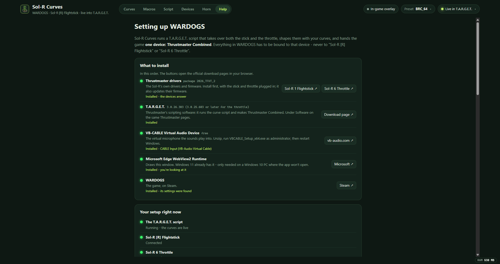

  

<h1 align="center">Sol-R Curves</h1>

  <b>Live response curves, macros, sounds and horn music for the Thrustmaster Sol-R in WARDOGS.</b> 
  Sol-R [R] Flightstick + Sol-R 6 Throttle · runs T.A.R.G.E.T. for you · Windows

  <a href="https://github.com/pgpavlides/wardogspilot/releases/tag/solr-curves-v1.1.0"><b>Download 1.1.0</b></a> ·
  <a href="#getting-started">Getting started</a> ·
  <a href="#features">Features</a> ·
  <a href="#develop">Develop</a>

  

---

## What it does

WARDOGS gives a HOTAS very little to work with. Sol-R Curves sits between the stick and the game:

- **Curves**: shape how roll, pitch, yaw and the throttle respond, and hear the change in the game within a quarter of a second, without restarting anything.
- **Macros and sounds**: put a key sequence or a soundboard clip on any button. Four banks sit on the base's knob, and the throttle has banks of its own.
- **Horn Music**: play 51 songs, or any MIDI file, on the helicopter's real horn, through your mic.
- **No T.A.R.G.E.T. window needed**: the app writes, compiles and runs the T.A.R.G.E.T. script itself, and gives the game one clean device, *Thrustmaster Combined*.

## Getting started

1. Install what it needs. The in-app **Help** page has the same list, with live checks:
   - [Thrustmaster drivers and T.A.R.G.E.T.](https://support.thrustmaster.com/en/product/sol-r-1-flightstick-en/): T.A.R.G.E.T. 3.0.25.603 or later is needed for the throttle.
   - [VB-CABLE](https://vb-audio.com/Cable/), the virtual microphone for sounds and horn music.
   - WebView2: Windows 11 already has it.
2. Run **`Sol-R Curves_1.1.0_x64-setup.exe`** from the [release](https://github.com/pgpavlides/wardogspilot/releases/tag/solr-curves-v1.1.0).
3. Start **Sol-R Curves first**, then WARDOGS. Bind everything in the game to **Thrustmaster Combined**. The Help page has the axis and button numbers, and **Fix bindings** moves existing ones over for you.

Closing the window keeps the app running in the tray at about **28 MB**, and the stick keeps working. Quit it from the tray.

## Features

### Curves

Edit each axis with an S-curve, a shape (expo, power, sine…) or your own points, with each side on its own if you like. **All curves** overlays all four axes, and the eye buttons hide the ones you don't need. **Side by side** shows them as a 2×2 grid. Live dots show your hand and what the game actually receives. Presets are built in, including **Sim_Control_TY_Settings**, which is Sim Controls' WARDOGS VKB curves, converted.

  
  

### Macros and sounds, in 3D

The stick and the throttle, each in 3D. Press a button (or click it) to set what it does: a **sound** through your mic with push-to-talk held, or a **macro** of keys. The base's knob picks the stick's bank. The throttle has its own banks: hold **48 / 49 for 3 seconds** to step through them. Pads with nothing on them go dark.

  
  

### Horn Music

The real WARDOGS heli horn is built in: eight honks, from short to long, and each note uses the honk closest to its length. You get 51 songs to start: memes, film themes, games and car-horn classics. You can also import any MIDI file: pick its tracks, transpose it and set the speed. Play it into voice chat, or **put a song on a stick button** like any other sound.

  

### Script, devices and help

The built-in T.A.R.G.E.T. script, with its live console, and an editor for your own scripts. Both devices, their T.A.R.G.E.T. status and pictures. A Help page that checks your setup and links to everything you need to install.

  
  
  

## How it works

- **Curves:** the app writes the curves to `C:\SolR\hotas_curves.txt`: 4 axes (roll, pitch, yaw, throttle) × 257 samples, with a dated log line. The script re-reads that file every 250 ms and confirms each table it loads in `C:\SolR\hotas_curves.ack`, which is when the app shows **Live in T.A.R.G.E.T.**
- **The script:** it takes over the stick and the throttle and hands the game *Thrustmaster Combined*. Stick buttons are 1–44, and the throttle's buttons and hats are 45–62. The app runs it through Thrustmaster's own service (`TmServiceControl.dll`, the Script Editor's call sequence, `src-tauri/src/target.rs`).
- **Sounds:** sounds and horn songs play through the WARDOGS soundboard's engine, to VB-CABLE and to your monitor, with Caps Lock (the game's push-to-talk) held.
- **Your data:** everything lives in `C:\SolR`: curves, presets, styles, voice settings, scripts, and the horn and its songs. `SOLR_DIR` points it somewhere else.

## Develop

Tauri 2 + Rust + React.

- `npm run dev`: Tauri window with hot reload
- `npm run build`: release exe + NSIS installer (`src-tauri/target/release/bundle/nsis/`)
- `npm run web`: the same UI in a browser. File writes go through the Vite middleware in `vite.config.ts` instead of Rust, and `src/bridge.ts` picks which.
- `target/`: the T.A.R.G.E.T. scripts. `hotas_wardogs_solr.v1_scurve.tmc` is the fixed-curve fallback that needs no app.

**Checks**

- `npm run check`: the curve maths matches T.A.R.G.E.T.'s `fcurve`; also covers split sides and migration.
- `npm run test:rust`: covers the curve file (parsed exactly like the script parses it), bindings, LEDs, and the horn (pitch, honk splitting, MIDI, rendering).
- Browser tests, against a second server so they never touch `C:\SolR` (`set SOLR_DIR=.testdata/ && npx vite --port 5179`): `node scripts/e2e.mjs`, `node scripts/addpoint.mjs`, `node scripts/layout.mjs`.
