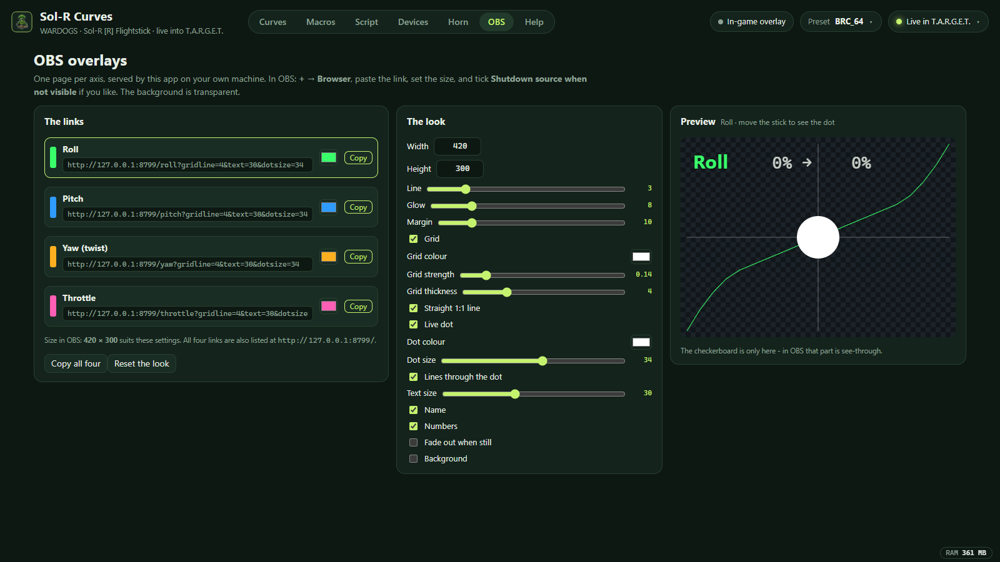

# OBS

## The overlays

While Sol-R Curves is running it serves one page per axis, for OBS Browser Sources:

```
http://127.0.0.1:8799/roll
http://127.0.0.1:8799/pitch
http://127.0.0.1:8799/yaw
http://127.0.0.1:8799/throttle
```

Each draws that axis's curve, the live dot (where your hand is, and what the game gets) and the numbers, on a transparent background. Opening `http://127.0.0.1:8799/` lists all four.

**In OBS:** + → Browser, paste the plain link, set Width and Height, and tick *Shutdown source when not visible* if you like. That is the whole setup - the links never change.

**The look lives in the app.** The **OBS** tab has every option as a control, a colour picker per axis, a live preview on a checkerboard and Copy buttons. What you set there is saved to `C:\SolR\obs_style.json` and pushed to every open overlay at once, so OBS picks it up while it is running - no reloading a source, no editing a URL.



### The options

Set these in the app's OBS tab. They are also query parameters (`…/roll?dotsize=40`) for a one-off: anything put in the link is pinned and the app no longer changes it. Colours are hex with or without `#`, and switches take `0` or `1`.

| Option | What it does | Default | Range |
| --- | --- | --- | --- |
| `color` | the curve's colour | roll `39ff6a`, pitch `2f9bff`, yaw `ffb020`, throttle `ff5fb4` | any hex |
| `line` | how thick the curve is | `3` | 1–12 |
| `glow` | the glow around the curve and the dot | `8` | 0–40 |
| `pad` | margin between the drawing and the edge | `10` | 0–80 |
| `text` | the name and the numbers, top left | `13` | 8–64 |
| `label` | show the axis name | `1` | 0 / 1 |
| `nums` | show the numbers (hand → game) | `1` | 0 / 1 |
| `grid` | show the grey lines | `1` | 0 / 1 |
| `gridcolor` | their colour | `ffffff` | any hex |
| `gridalpha` | how strong they are | `0.14` | 0–1 |
| `gridline` | **how fat the grey lines are** - the grid, the 1:1 line and the lines through the dot | `1` | 0.5–14 |
| `ideal` | the straight 1:1 line behind the curve | `1` | 0 / 1 |
| `dot` | the live dot | `1` | 0 / 1 |
| `dotcolor` | its colour | `ffffff` | any hex |
| `dotsize` | **how big it is** - turn this up for streaming to phones | `7` | 2–80 |
| `guide` | the grey lines through the dot (thickness comes from `gridline`) | `1` | 0 / 1 |
| `bg` | a background colour instead of transparent | transparent | any hex |
| `round` | rounded corners, with a background | `0` | 0–60 |
| `fade` | fade out when the axis has been still for 2 s | `0` | 0 / 1 |

For a vertical (phone) stream, bigger is better: text around 30, grid thickness 4, dot size 34, line 5.

### How it works

`src-tauri/src/obs.rs` is a small HTTP server inside the app - no crates, and it binds `127.0.0.1` only, so nothing is exposed to the network. It tries ports 8799-8804 and takes the first free one (the app's OBS tab shows which). Routes:

| Route | What it serves |
| --- | --- |
| `/` | the four links |
| `/<axis>?options` | the overlay page (`src-tauri/assets/obs/overlay.html`) |
| `/live` | server-sent events: the look and the curve when they change, and where each axis is 30 times a second |

The curve comes from `C:\SolR\hotas_curves.txt` - the same table the T.A.R.G.E.T. script reads - and which input each axis uses from `hotas_curves.json`. Both are re-read when they change, so an overlay follows the app without being told. The positions come from the stick and throttle feeds inside the app, so the overlay works whether or not the game is running.

## The profile: YouTube Vertical 1080x1920

`YouTube_Vertical_1080x1920/` is an OBS profile for streaming to YouTube on phones (the Shorts feed only takes a vertical stream).

| | |
| --- | --- |
| Canvas and output | 1080 × 1920 (9:16) |
| Frame rate | 60 fps |
| Encoder | NVENC H.264, CBR **9000 kbps**, keyframe every 2 s, preset p5, profile high, 2 B-frames, psycho-visual tuning on |
| Audio | AAC 160 kbps, 48 kHz stereo |
| Recording | the same encoder at CQP 20, hybrid MP4, into `D:\Recordings\OBS` |
| Service | YouTube – RTMPS, **stream key left empty** |

YouTube asks for a keyframe every 2 s (4 s at most) and 128 kbps or more of audio, and gives 1080p60 as 12 Mbps recommended within a 4–10 Mbps range; a 1080 × 1920 frame is the same pixel count as normal 1080p, so the same numbers apply. If the upload can't hold it, drop to 30 fps first, then to 6000 kbps, and keep the resolution.

**To install it:** copy `YouTube_Vertical_1080x1920/` into
`%APPDATA%\obs-studio\basic\profiles\`, start OBS again, and pick it under
**Profile**. Then paste your stream key into Settings → Stream.

`obs64.exe --profile "YouTube Vertical 1080x1920"` starts OBS on it - the quotes
matter, or OBS reads only the first word and keeps the profile it had.

On a 1080 × 1920 canvas the game (16:9) sits across the middle, leaving room above and below for a camera, titles or these overlays - about 540 × 380 each suits that space.
